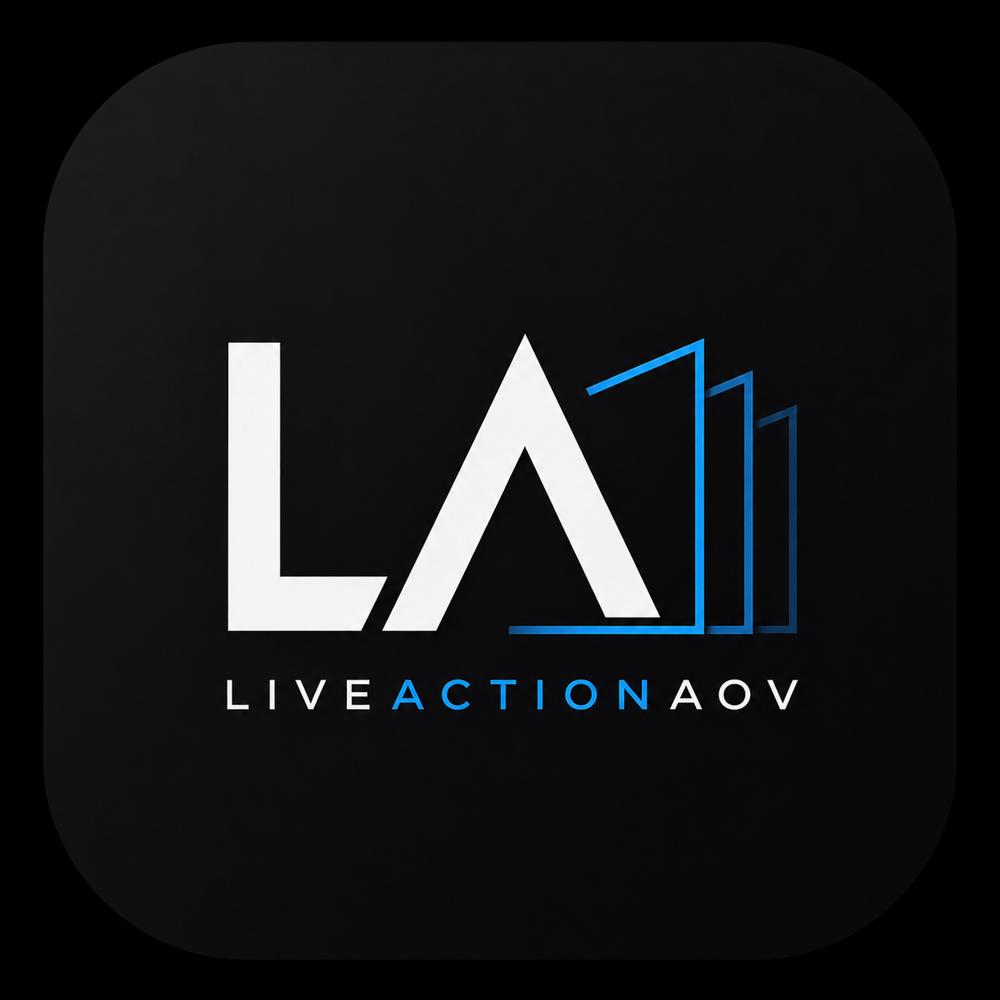
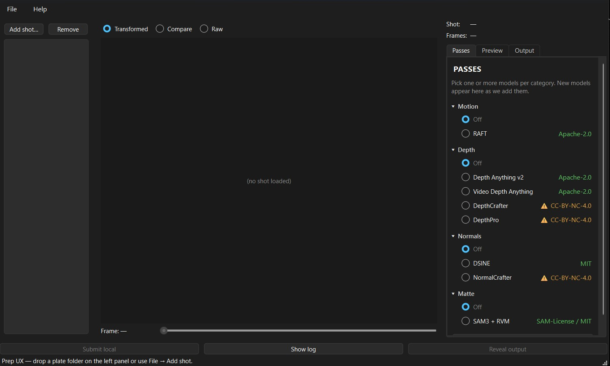

<p align="center">
  
</p>

# LiveActionAOV

**AI-driven AOV pass generator for VFX plates.** Reads EXR image sequences, runs depth / normals / motion / matte passes, writes sidecar EXRs with Nuke-ready channel conventions.

> **Status:** alpha, pre-v1 release

[](https://youtu.be/TODO_REPLACE_AFTER_UPLOAD)
*Demo video — coming soon.*

---

## Quick start

```bash
git clone https://github.com/lettidude/LiveActionAOV
cd LiveActionAOV
./install.sh        # or install.bat on Windows
```

Then:
```bash
uv run liveaov-gui           # preparation GUI
uv run liveaov --help        # CLI reference
```

> **First run downloads model checkpoints from Hugging Face.** Expect
> **~1.5 GB** for a minimal stack (Depth Anything V2 + DSINE + RAFT +
> SAM 3 + RVM) up to **~11 GB** for the full video-aware stack
> (DepthCrafter + NormalCrafter + MatAnyone 2). Cached at
> `~/.cache/huggingface/hub` (Linux/macOS) or
> `%USERPROFILE%\.cache\huggingface\hub` (Windows). Subsequent runs are
> offline-capable for any pass whose weights you've already pulled.
>
> **What is `uv`?** A fast Python package manager from Astral —
> drop-in replacement for `pip` + `venv`. The installer scripts grab
> it for you. See [docs.astral.sh/uv](https://docs.astral.sh/uv/) if
> you'd rather install it yourself first.

---

## What it does

Given a plate like `/shots/sh020/plate/v003/sh020_plt.####.exr`, the tool produces:

- `/shots/sh020/plate/v003/sh020_plt.utility.####.exr` — sidecar with:
  - `Z` depth channel
  - `N.x / N.y / N.z` camera-space normals
  - `motion.x / motion.y` forward motion vectors (pixels)
  - `back.x / back.y` backward motion vectors
  - `matte.r / g / b / a` top-4 soft hero mattes
  - `mask.<concept>` semantic hard masks
  - `P.x / P.y / P.z` world-space position (when depth is present)
  - `ao.a` ambient occlusion (when depth + normals are present)

Original plate is never modified. See [design notes](docs/architecture.md) for architectural details.

---

## The GUI

Drop a plate folder onto the shot list, pick the passes you want, hit **Submit local**. Each model surfaces its license badge inline so you know up-front which combinations are commercial-safe and which require non-commercial confirmation.

<p align="center">
  
</p>

<!--
TODO: add a second screenshot of a loaded shot (with viewport rendering
and a real plate) once the example plate is non-confidential. Suggested
filename: docs/img/gui-loaded-shot.jpg
-->

---

## Nuke plugin — UtilityRelight

A companion Nuke node ships in this repo at
[`src/live_action_aov/plugins/nuke/UtilityRelight/`](src/live_action_aov/plugins/nuke/UtilityRelight/).
It consumes a sidecar EXR + a beauty plate and gives Nuke comp artists
live 3D light placement on the subject — six layered light contributions
(key, spec, rim, bounce, glow, fog) computed on the GPU via BlinkScript.

**Install (3 steps):** copy `utility_relight.py` + `UtilityRelightKernel.blink` into `~/.nuke/`, register in `~/.nuke/menu.py`, restart Nuke. Full instructions and quick-test recipe in the [user guide](docs/user-guide.md#nuke-plugin--utilityrelight).

Tested on Nuke 16.0.

---

## Documentation

- [User guide](docs/user-guide.md)
- [Developing plugins](docs/developing-plugins.md)
- [Architecture](docs/architecture.md)

---

## Author

**Leonardo Paolini** — VFX compositor / pipeline TD building tools at the intersection of comp and ML.

- Email: [LeonardoVFX@gmail.com](mailto:LeonardoVFX@gmail.com)
- GitHub: [@lettidude](https://github.com/lettidude)
- LinkedIn: [leonardopaolinivfx](https://www.linkedin.com/in/leonardopaolinivfx/)
- IMDb: [Leonardo Paolini](https://www.imdb.com/name/nm5886055/)
- YouTube: [@LeonardoVFX](https://www.youtube.com/channel/UCZDR5tThQwo9OVVu-NmODbA) — pipeline & VFX-tooling videos

Developed with [Claude](https://claude.com/) (Anthropic).

---

## Support

- **Bug reports / feature requests:** [open an issue](https://github.com/lettidude/LiveActionAOV/issues).
- **Questions about a specific pass / model wiring:** start a [discussion](https://github.com/lettidude/LiveActionAOV/discussions).
- **Direct contact:** [LeonardoVFX@gmail.com](mailto:LeonardoVFX@gmail.com) — fastest for studio-pipeline questions.

---

## License

Core: MIT. Individual model plugins have their own licenses — see the license matrix in [architecture notes](docs/architecture.md#license-matrix). Every sidecar EXR carries a `liveActionAOV/<pass>/license` metadata stamp plus a top-level `liveActionAOV/matte/commercial` flag so downstream QC can audit what's shippable.
